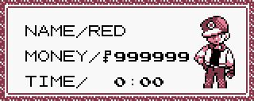

# Mechanisms of infinite money

Regardless of their name, all cheat devices work in the same way: they write values to the memory.

For instance, if one were to look up an "Infinite Money" code for the *GameBoy* game **Pokémon RED**, the very first result would be the following list of numbers:

<div class="right">
  
  <center class="legend">Not just rich, infinitely rich!</center>
</div>

```
019947D3
019948D3
019949D3
```

Using these as a GameShark code in an emulator, and starting a new game, we get the desired outcome: our character is now rich and will stay that way until we disable the code.

Codes for some consoles may have sophisticated specifications, some even including actual *programming code* in them, but the GameShark for Gameboy is simple: an eight-number code is meant to be split into the arguments for a function with the prototype `writeValueToOffset(u8 rombank, u8 value, u16 offset)`, giving us the following pseudo-code:

```
writeValueToOffset(0x01, 0x99, 0x47D3)
writeValueToOffset(0x01, 0x99, 0x48D3)
writeValueToOffset(0x01, 0x99, 0x49D3)
```
<div class="warning">
  <h4>Attention!</h4>

  The GameBoy being a *low-endian* game system, the addresses `0x47D3`, `0x48D3`, and `0x49D3`, are respectively: `0xD347`, `0xD348`, and `0xD349`, and therefore follow each other.
</div>

But now this code just drives more questions: what would happen if we only used one of those three codes? Let's try again with something else:

<div class="right">
  
  <center class="legend">Another kind of rich</center>
</div>

```
011247D3 # writeValueToOffset(0x01, 0x12, 0x47D3)
013448D3 # writeValueToOffset(0x01, 0x34, 0x48D3)
015649D3 # writeValueToOffset(0x01, 0x56, 0x49D3)
```

After disabling the previous code, and trying this one, we can see the results and make our deductions: each of the three memory addresses from `0xD347` to `0xD349` is responsible for two digits of the player money.

Actually, we could just write `99` in `0xD347` and make our hero very close to being a millionaire, but a pretty number is way more satisfying, isn't it?

<div class="notice">
  <h4>Did you notice?</h4>

  Astute readers may notice something strange: the value is written in hexadecimal as `0x99` (equal to `153` in decimal), but the number displayed is `99` in decimal. This is because in Pokémon Red, money is stored as a **Binary-Coded Decimal**[^bcd], and not as hexadecimal. Storing big numbers as Binary-Coded Decimals is a method that was popular on older processors, like the SM53 the GameBoy uses.
</div>

Another interesting thing to notice is that as long as the code is enabled, our money will stay fixated on the same number no matter how many times we decide to go on a shopping spree. This is because the ActionReplay devices work by writing values to memory each time a frame is rendered[^vblank], resetting our money around 60 times per second.

* * *

[^bcd]: As evidenced in the [disassembly code](https://github.com/pret/pokered/blob/1f6e2bf999401b9444f939bb40c1eb279bc51829/engine/menus/start_sub_menus.asm#L556C7-L556C21).
[^vblank]: If you want to get really technical about it: they are hooking themselves to the VBlank Interrupt handler.
