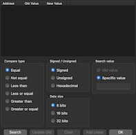

# The way of the cheat finder

<div class="right">
  
  <center class="legend">The cheat finder from VBA-M.</center>
</div>

All cheat engines perform the same work for you: you give them a number to look for, and they will scan the whole memory to look for it.

Unfortunately, things are not so easy: a GameBoy got "8Kbytes" of RAM[^1], which means precisely 8192 bytes (or addresses). Given that a byte can have only one of 256 values, it means that on average, the number you're looking for could be found in 32 bytes... we're still not close to finding our magic byte!

Picking a Bulbasaur starting with 20 HP, we're lucky that our cheat finder reports only 16 bytes contain the decimal value "20". We could modify all of these one by one, probably breaking the game many times in the process, but our cheat finder can still help us.

An attack from our rival's Pokémon will change the value of our HP to 16. Let's run the cheat finder again with that new value: the cheat finder will reduce the number of results for us, and this time only 4 bytes remain.

Let's continue fighting and running the cheat finder with new values, until only one byte remains.

Congratulations!

If you find `0xD016` (or rather `0x16D0` in little endian), you can now set it to the arbitrary value of your choice, and your Pokémon will never again have to suffer from fainting in battle. Pull back a few pages to see how a GameBoy GameShark code is formed and you should come up with the following code:

```
019916D0
```

You are about to add this cheat in the game straight away, but suddenly, a question pops in your head: 

>"What if this code was wrong and it were to damage my Pokémon?"   
>― You, dear reader, suddenly overcome by fear and self-doubt

Sure, you may trust the methodology. After, all, you read it in a book, and you know science in books is always true. But you're not sure you did input the correct values at the right time, or maybe you didn't click the correct button in the cheat finder. You're not a hacker (yet), and you don't feel confident enough to make your beloved Pokémon partner the subject of a four bytes code.

Another question pops in your head:

>"Is there a way to find this result on my own in a firesure way?"   
>― You, my reader, about to get a happy surprise on the next page

Well, guess what? There is a way to do it on your own, like a hacker.

* * *
[^1]: According to the [official documents by Nintendo](https://www.nintendo.com/en-gb/Support/Game-Boy-Pocket-Color/Product-information/Technical-data/Technical-data-619585.html).
