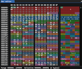

# Basic knowledge

This book is written with *dabblers* in mind.

While more experienced bounty hunters are already used to most of the techniques I will discuss, describe, and use in this book, they may appreciate the storytelling, or see how reverse engineering is used in other fields they may be unfamiliar with.

This book expects some basic programming knowledge, not in any specific language, but at least some familiarity with one.

## Bits, binary, decimal, hexadecimal, and bytes
Human beings use the decimal system because it's clearer to them.

Computers, however, function in binary (bits: one or zero), and use the hexadecimal system to access and represent data as bytes. Hexadecimal, composed of "hexa" (6), and "decimal" (10), is a different numeral system using base 16: counting up goes from 0 to 9, then from A to F, and to 10. The mental gymnastic is a bit hard to get to, but easy to understand.

To properly differentiate numerical systems used in this book, prefixes `0b` and `0x` will be used for binary and hexadecimal values respectively, as shown in the quick recap table below.

| Raw bits    | Binary     | Hexadecimal | Decimal | Decimal (signed) |
|-------------|------------|-------------|---------|------------------|
| `0000 0000` | 0b00000000 |        0x00 |       0 |                0 |
| `0000 0001` | 0b00000001 |        0x01 |       1 |                1 |
| `0000 0010` | 0b00000010 |        0x02 |       2 |                2 |
| `0000 0011` | 0b00000011 |        0x03 |       3 |                3 |
| `0000 0100` | 0b00000100 |        0x04 |       4 |                4 |
| `0000 1000` | 0b00001000 |        0x08 |       8 |                8 |
| `0000 1001` | 0b00001001 |        0x09 |       9 |                9 |
| `0000 1010` | 0b00001010 |        0x0A |      10 |               10 |
| `0000 1011` | 0b00001011 |        0x0B |      11 |               11 |
| `0000 1100` | 0b00001100 |        0x0C |      12 |               12 |
| `0000 1101` | 0b00001101 |        0x0D |      13 |               13 |
| `0000 1110` | 0b00001110 |        0x0E |      14 |               14 |
| `0000 1111` | 0b00001111 |        0x0F |      15 |               15 |
| `0001 0000` | 0b00010000 |        0x10 |      16 |               16 |
| `0111 1111` | 0b01111111 |        0x7F |     127 |              127 |
| `0111 1111` | 0b01111111 |        0x80 |     128 |             -128 |
| `1111 1110` | 0b11111110 |        0xFF |     254 |               -2 |
| `1111 1111` | 0b11111111 |        0xFF |     255 |               -1 |

<div class="notice">
  <h4>Did you notice?</h4>

  Binary numbers makes it easy to perform some operations: you can double a number by shifting its numbers from right to left, quickly turning `0b0100` (4) into `0b1000` (8) and `0b10000` (16).

  You can also easily determine if a number is even or odd just by looking at its right-most bit: a `1` will ALWAYS indicate an odd number.
</div>

## File editors

<div class="right">
  
  <center class="legend">Look at these patterns!</center>
</div>

To view a file as hexadecimal data, there are many "hex editors" available online, but my personal preference goes to WerWolv's [**ImHex**](https://imhex.werwolv.net/).

While the software is very recent, and the UI can be a bit hard to get used to, it is the software that comes closest to my dream hexadecimal editor. Its powerful pattern language puts it MILES ahead of any competition, and had it existed ten years earlier, I would have used it instead of manually coloring cells in **Windows Excel** to spot repeating patterns in a file...

For code edition, any text editor will do[^nano]. I personally use [**Visual Studio Code**](https://code.visualstudio.com/) but nothing in this book requires it, so you're free to go with [**Sublime Text**](https://www.sublimetext.com/) or [**Atom**](https://atom-editor.cc/) if those are your preferences.

## Memory

In computer terms, "memory" stands for a lot of things, but there are only a few we really care about:

- **RAM: Random Access Memory**, is the one that will often comes first. While the "Random Access" part may sound strange[^ram], just remember that it's the "moving" part of memory, where programs are allowed to read and write to as much as they want.

- **ROM: Read-Only Memory**, which you probably already know from the "CD-ROM", is data you can read but cannot write to. Since games have historically been sold on proprietary cartridges that cannot be written to, this is why game files have been called "roms".

- **VRAM: Video RAM**, which is just a fancy term for RAM dedicated to video display.

- **WRAM: Work RAM**, an alternative name for RAM.

All types of memory are "byte-addressable", which means any position can be expressed as a byte.

| Address | Value  |
+---------+--------|
| `0x00`  | `0xDE` |
| `0x01`  | `0xAD` |
| `0x02`  | `0xBE` |
| `0x03`  | `0xEF` |

In the above example, byte `0x02` got value `0xBE`, and value `0xAD` can be found in byte `0x01`.

Technically, hard drive storage is ALSO a kind of memory (even more today with SSDs, which physically work like memory banks), but data is accessed through a file system.

## Data types

Letters and numbers and everything else that is shown to users is an abstraction of what happens inside the computer. Depending on the programming language, and the level of abstraction, different types will be available to the developer.

In this book, the types will be tied to basic C data types, which are mostly about data size.

The smallest data type is the `u8`, short for "unsigned integer of 8 bits", which is a single-byte long. Going by the above table, this means this variable can include values going from `0x00` to `0xFF` (or from 0 to 255). Next types in order of size are `u16` (`0x0000` to `0xFFFF`, or 0 to 65535)  and `u32` (`0x00000000` to `0xFFFFFFFF`, or 0 to 4294967295).

Signedness isn't used much, since we are often dealing with raw data, but it's useful to keep in mind that it exists.

<div class="notice">
  <h4>Did you notice?</h4>

  As a rule of thumb, both 15 and 16 (`0x0F` and `0x10`), or 255 and 256 (`0xFF` and `0x100`) are useful patterns numbers to remember.
  
  While the number "2147483647" (max value of a signed int of 32 bits) is a fun one to remember for a lot of reasons, but it's too high to be used in the kind of data we'll be approaching here.
</div>

A special data type is the **array**: it is used to group together multiple values of the same data type and is noted by brackets indicating its maximum length, if relevant.

For instance: `u8[4]` will occupy the same size in memory as `u32[1]`, with one containing four elements, while the other only contains one. If the array is of unknown length, the notation `(data_type)[]` will be used.

## Endianness

Endianness is a hell we must all go through.

For performance reasons, different hardwares over history had different ways to access data, and data alignement plays a big part of that. For instance, it's easier for a microprocessor to read either two bytes (`u16`) or four bytes (`u32`) of data at once, but not three bytes of data (very few systems actually implement something that could be called an `u24`, and I've never seen one in action).

For that reason, on some hardware, it is more advantageous to access data in a backwards fashion when it spans more than one byte, which is called **little-endianness**. However this backwardness only applies to bytes, and not to bits. Therefore, the data would be stored as follows in memory:

| Value | Big endian | RAW     | Little endian | RAW     |
|-------|------------|---------|---------------|---------|
|     0 |  0x00 0x00 | `00 00` |     0x00 0x00 | `00 00` |
|     1 |  0x00 0x01 | `00 01` |     0x01 0x00 | `01 00` |
|    16 |  0x00 0x10 | `00 10` |     0x10 0x00 | `10 00` |
|   255 |  0x00 0xFF | `00 FF` |     0xFF 0x00 | `FF 00` |
|   256 |  0x01 0x00 | `01 00` |     0x00 0x01 | `00 01` |
|  2024 |  0x07 0xE8 | `07 E8` |     0xE8 0x07 | `E8 07` |
| 59399 |  0xE8 0x07 | `E8 07` |     0x07 0xE8 | `07 E8` |
| 65280 |  0xFF 0x00 | `FF 00` |     0x00 0xFF | `00 FF` |
| 65535 |  0xFF 0xFF | `FF FF` |     0xFF 0xFF | `FF FF` |

<div class="warning">
  <h4>Attention!</h4>

  Take attention to the second and third lines: `00 01` (BE) becomes `01 00` (LE). As stated before, the **bytes** are reversed, but **not** the bits, so you must mentally take care to read backwards byte-by-byte, and not digit-by-digit.
</div>

## Functions

Functions are the base of all programming languages.

While they can come in all sort of syntaxes, depending on the language, this book will try its best to describe them only as "pseudo-C" prototypes, reducing them to their most basic elements: a function is described by a prototype, has a name, take ordered values as arguments, and it may return a value.

For instance, the following prototype `addTwoNumbers(u8, u8) -> u8` means "the function named `addTwoNumbers` must be provided two arguments of type `u8`, and returns an `u8` value". For further clarification, arguments can be named, so that `divideNumbers(u8 base, u8 divider) -> u8` makes it easy for the reader to understand which argument is the base number, and which is the divider.

## Structures

Structures are mostly used in C-like languages, but are used in some sort in all languages to hold multiple datas values together and pack them as a whole

A simple example of a struct would be the following:
```rust
struct Book {
  name:          String,
  release_year:  u16,
  release_month: u8,
  release_day:   u8,
  pages_count:   u16,
  rating:        u8
}
```

Something to keep in mind with struct elements is that they are often **padded** by the system so that they can be aligned together for easier access. In our "Book" example, (and ignoring the `String` type which is a bit special), we can see the struct is composed of two `u16` and three `u8`, making it 56-bits (7 bytes) long. Since it would be easier for a system to align its data on 64 bits (8 bytes), there is a huge chance the structure will be padded, making it actually look like the following in memory:

```rust
struct Book {
  name:          String,
  release_year:  u16,
  release_month: u8,
  release_day:   u8,
  pages_count:   u16,
  rating:        u8,
  padding:       u8
}
```

Depending on the language, the system architecture, and many other variables, padding can play out in a lot of ways. Therefore, while it's useful to know and think about, it's not a deterministic element.

## Programming

I will try my best to make this book accessible to non-programmers.

However, when code is REQUIRED to illustrate something, it will be written in the most accessible way possible, making it easy for non-programmers to understand this code, or to port it to another language if they want to test it on their own.

Languages come into two flavors: *interpreted* or *compiled*. The first kind means the human-readable source code is read by an *interpreter* program, and then ran; these are usually the easier languages to learn. The second kind means the human-readable source code will be transformed into a program called *a binary* that the user can run anytime they want; since we don't have access to the source code, these are the ones we will be working on.

If you are not a programmer yet, and would like to pick up a language to learn, I recommend either **Ruby** or **Python**: they are interpreted languages and good starting points for beginners, can be equally powerful when you will be used to them, and will help you cover all the basics you need to quickly and easily understand other languages. While my own personnal preference goes towards the former, I encourage you to look at code written in both languages to see which one feels the more appealing and readable to you: there is no point in learning a language you don't like.

## Terminal

The Terminal, the CLI (Command-Line Interface), the PowerShell,...

This book can be enjoyed without using it, but if you want to run some of the binaries included with it, it can be useful to familiarize yourself with one. Most modern systems come with one, whether you are on MacOS (Terminal), Windows (PowerShell), or Linux (too many to choose).

When describing command-line programs, I will make sure to explain them, or keep them simple enough so that the command is easy to understand.

* * *
[^ram]: Just picture a bookcase: if you want to access the fifth book from the left, on the middle shelf, you can pick it out straight away, without having to pick out all books starting from the top shelf. This is the meaning of "Random Access".
[^nano]: You can fight over eMacs or vim all you want, but in this house, we use nano!
