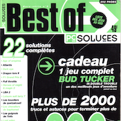
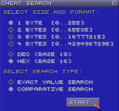

# Introduction

For as long as I can remember, I have always been a tinkerer.

As a child, my fingers were playing with LEGO bricks, and obtaining my first personnal computer[^pc] when I was barely six years old led me to another type of tinkering. My father taught me to use it, install softwares (games), configure and run them, play around with their files,... But without access to the Internet, all I could learn was on my own.

* * *

  
  
Little Big Adventure 2

One of my earliest memories was a demo of **Little Big Adventure 2**[^lba2] contained on a CD. The demo only contained three areas: an island, a cave, and a company building looking like a bank. Doing any action to exit one area, such as entering a house on the island, would lead to the next area: it felt strange to me that entering a building on an island would get me into a cave. By looking at the game files on my desktop, I found a solution: as they were three areas, there were three files in a `SAVE` folder: `DEMO0.LBA`, `DEMO1.LBA`, and `DEMO2.LBA`.

I renamed `DEMO2.LBA` to `DEMO1.LBA`, copied `DEMO0.LBA` to `DEMO2.LBA`, and restarted the demo: I entered the first building on the island and found myself in the bank. I shortly made the character walk backwards to exit the building, and he was on the island again. I felt satisfied with myself and forgot about the demo, until I bought the full game a few years later.

* * *

  
  
Still got it to this day!

As I grew older, I tried to open my **Tomb Raider** save games, but the Windows Notepad would only show me a lot of spaces and strange characters, with the only readable part being the level name right in the middle. I tried to change it to another level name, and booted the game: my savegame did indicate the name of that other level, but loading it still sent me to the original level. I was missing something.

Thankfully, I had the luck to stumble on a game cheats magazine[^pcsoluces] that contained game solutions, cheats, and codes, but, more importantly, a full lesson on how those codes worked. In those few pages, I learned how data worked, what **hexadecimal** was and why `0x0A` came after `0x09` instead of `0x10`.

* * *

  
  
The ZSNES cheats searcher

What this magazine never taught me was how to look for cheats: I learned with the Internet. Discovering Super Nintendo emulation with ZSNES, I spent a lot of time playing with its cheats searcher.

Discovering myself to be a huge fan of Japanese RPG games, the Super Nintendo quickly became my favourite console, and I would often play games, search for various ways to cheat, and learn about romhacking. While I never used that knowledge to work on my own romhack, a huge part of it would subconsciously make its way in my brain....

* * *
Years later, as an adult, I ended up working in the IT industry.

My curiosity and the breadth of knowledge I had acquired over the years led people to label me their "in-house hacker" and I've often been the go-to employee for insane solutions: How is our concurrent's product working? Can we retrieve informations from this proprietary database? Could we hook our own process on this website's database? Did you just drop a 0-day for our payment processor? We've been scraped by a concurrent, you got something to prevent that?

While all of these feats sounded "amazing" to my friends and work peers, imposter syndrome got the better of me. For a long time, that knowledge and know-how just felt "normal" to me, and even "subpar" when comparing it to more dedicated hackers I admired.

My first vision of the Internet was with a 14.4K dial-up modem with a Formula 1-looking device on the box[^modem]. I've been online for close to 30 years, reading and consuming content about my passion for "hacking" and reverse-engineering. While there exists a lot of people and projects dedicated to the preservation of knowledge online, I feel that the Web 2.0 trend and rise of social networks is slowly putting knowledge behind paywalls.

* * *
This book intends to work on those two problems.

I hope you will have as much fun reading and learning from this book, as I'm taking solace in sharing the way my knowledge and working process were formed.

* * *
[^pc]: At the time, it was equiped with an Intel i386 processor.
[^lba2]: It seems [this demo has been archived](https://magicball.net/downloads/lba2-demo/).
[^pcsoluces]: The magazine, [PC Soluces Hors-série 2, has been archived](https://www.abandonware-magazines.org/affiche_mag.php?mag=110&num=4473&album=oui).
[^modem]: If anyone finds a photo of the box I'm talking about, I'm interested.
